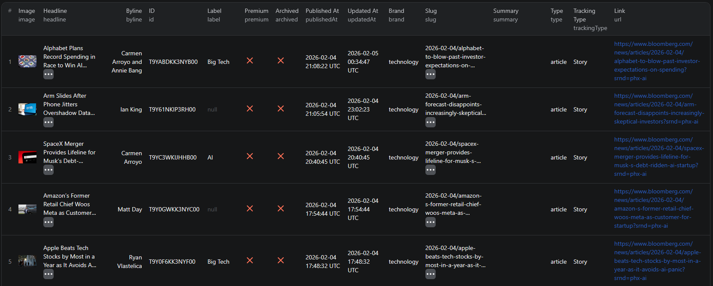

# How to Scrape Bloomberg News in Node.js

This example shows how to scrape Bloomberg category news pages in Node.js using the [Bloomberg Category News Scraper](https://apify.com/piotrv1001/bloomberg-category-news-scraper) actor on Apify — no browser automation or custom scraping code required.



## What this example does

- Calls the Bloomberg Category News Scraper actor via the Apify API
- Passes a list of Bloomberg category URLs and a per-URL item limit as input
- Waits for the actor run to complete
- Fetches the results from the run's dataset
- Prints each article object to the console

## Prerequisites

- [Node.js](https://nodejs.org/) v18 or higher
- An [Apify account](https://console.apify.com/)
- An [Apify API token](https://console.apify.com/account/integrations)

## Installation

```bash
npm install
```

## Environment setup

```bash
cp .env.example .env
```

Open `.env` and replace `your_apify_token_here` with your actual Apify API token.

## Usage

```bash
npm start
```

## Code example

```js
import { ApifyClient } from 'apify-client';
import 'dotenv/config';

// Initialize the ApifyClient with your Apify API token
// Set APIFY_TOKEN in your .env file (copy .env.example to get started)
const client = new ApifyClient({
    token: process.env.APIFY_TOKEN,
});

// Prepare Actor input
const input = {
    "searchUrls": [
        "https://www.bloomberg.com/ai",
        "https://www.bloomberg.com/crypto"
    ],
    "maxItemsPerUrl": 10
};

// Run the Actor and wait for it to finish
const run = await client.actor("piotrv1001/bloomberg-category-news-scraper").call(input);

// Fetch and print Actor results from the run's dataset (if any)
console.log('Results from dataset');
console.log(`💾 Check your data here: https://console.apify.com/storage/datasets/${run.defaultDatasetId}`);
const { items } = await client.dataset(run.defaultDatasetId).listItems();
items.forEach((item) => {
    console.dir(item);
});

// 📚 Want to learn more 📖? Go to → https://docs.apify.com/api/client/js/docs
```

## Example output

See [`sample-output.json`](./sample-output.json) for a full example. Each article object contains:

| Field | Description |
|---|---|
| `headline` | Article title |
| `byline` | Author name |
| `url` | Full URL to the article |
| `label` | Category label (e.g. `AI`, `Big Tech`, `Crypto`) |
| `brand` | Bloomberg brand section (e.g. `technology`, `markets`) |
| `publishedAt` | ISO 8601 publish timestamp |
| `updatedAt` | ISO 8601 last-updated timestamp |
| `image` | Thumbnail image URL |
| `premium` | Whether the article is behind a paywall |
| `type` | Content type (e.g. `article`) |
| `slug` | URL slug |
| `id` | Unique article ID |

## Use cases

- **News aggregation** — pull the latest Bloomberg articles across multiple categories into a single feed
- **Financial research** — monitor Bloomberg's markets, crypto, and economics sections for investment signals
- **Media monitoring** — track how often specific topics (AI, crypto, climate) are covered on Bloomberg
- **Content pipelines** — feed Bloomberg headlines into newsletters, dashboards, or alerting systems
- **Sentiment analysis** — collect article headlines and metadata to run NLP or sentiment models on financial news

## Try the actor on Apify

**[Open the Bloomberg Category News Scraper on Apify](https://apify.com/piotrv1001/bloomberg-category-news-scraper)**

## Related resources

- [How to Scrape Bloomberg News Articles](https://www.falconscrape.com/blog/how-to-scrape-bloomberg-news-articles) — in-depth blog post covering the scraper setup and use cases

## License

MIT
